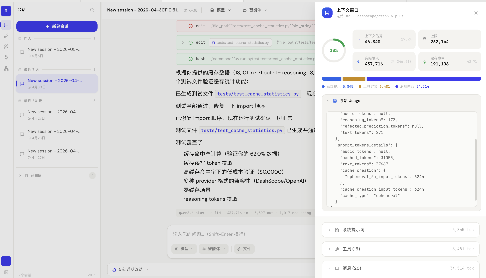
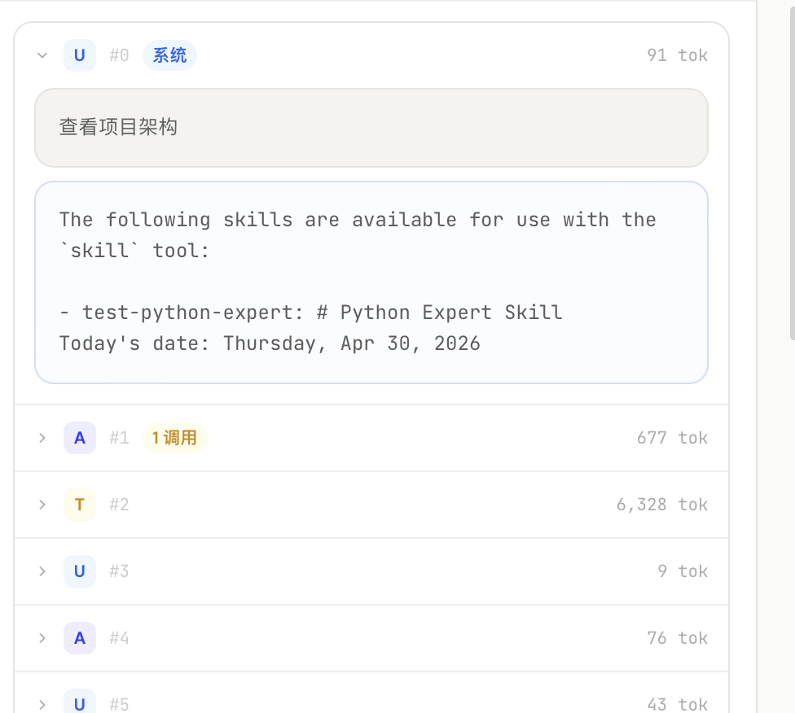
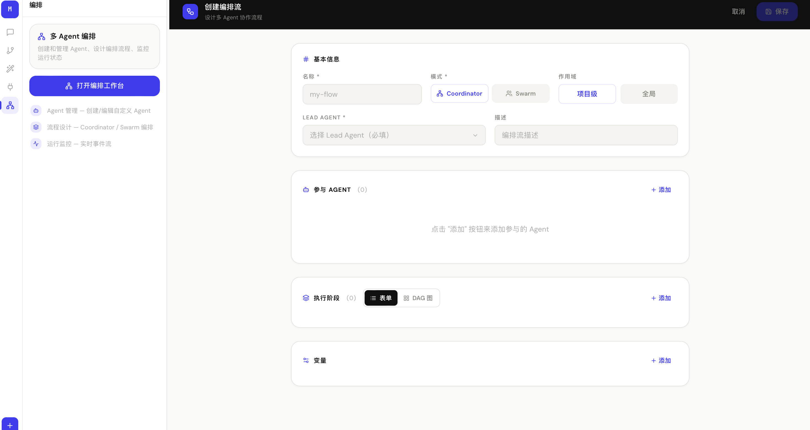

# MyCode

**AI coding agent — Python edition.**

一个不绑定特定 AI 提供商的开源编程 Agent 平台。支持 CLI、HTTP API 和 Web UI 三种交互方式。

> **架构说明**：初始版本根据 [OpenCode](https://github.com/anomalyco/opencode)（TypeScript 版）架构使用 Python 重写，涵盖 session/processor agentic loop、tool 系统、permission 模型、memory 系统、event bus、config 多层合并等核心设计，使用 Python 生态工具链（litellm、FastAPI、SQLAlchemy、Click+Rich 等）实现。后续参考 [Claude Code](https://docs.anthropic.com/en/docs/claude-code) 的设计理念进行了改进，包括 system-reminder 动态注入（将 skills 列表和 memory 从 system prompt 迁移到 messages 尾部以复用 prefix cache）、三层循环保护、读写分离工具执行、两层记忆系统、增量式 reminder（history-aware state extraction）、统一的子代理工具（delegate/parallel/isolated 三种模式）、会话暂停/恢复、文件变更暂存与批量回退、Git 集成等增强特性。

---

## 快速开始

```bash
# 安装
uv sync

# 查看帮助
uv run mycode --help

# 设置 API Key（任意 OpenAI 兼容接口）
export OPENAI_API_KEY="your-token"
export OPENAI_API_BASE="https://your-endpoint.com/v1"  # 可选，默认 OpenAI 官方

# 交互式模式（Rich UI + Markdown 渲染 + 上下文进度条）
uv run mycode run

# Headless 模式（单次执行，适合脚本/CI）
uv run mycode run --message "列出当前目录的文件"

# 启动 API Server
uv run mycode serve --port 4096

# 一键启动后端 + 前端开发服务器
uv run mycode dev                            # 后端 :4096 + 前端 :3000
uv run mycode dev --port 8080 --frontend-port 5173  # 自定义端口

# 启动 Web UI（手动分别启动）
cd web && npm install && npm run dev   # :3000，代理 API 到 :4096

# 构建 Web UI 后单端口运行
cd web && npm run build
uv run mycode serve --port 4096      # 打开 http://localhost:4096

# 运行测试
uv run pytest tests/ -v
```

## 架构总览

```
┌─────────────────────────────────────────────────────────┐
│                        Clients                          │
│  CLI (click)  │  HTTP API (FastAPI)  │  Web UI (React)    │
└──────┬────────┴──────────┬───────────┴──────────────────┘
       │                   │
       ▼                   ▼
┌─────────────────────────────────────────────────────────┐
│              Session Layer (prompt.py)                   │
│  ┌─────────────┐  ┌──────────────┐  ┌───────────────┐  │
│  │ Agent 选择   │  │ System Prompt│  │  Tool 加载     │  │
│  └──────┬──────┘  └──────┬───────┘  └───────┬───────┘  │
│         └────────────────┼──────────────────┘           │
│                          ▼                              │
│              ┌─── Agentic Loop ───┐                     │
│              │                    │                     │
│              │  Processor ──────► LLM Stream (litellm)  │
│              │     │              │  ↓                   │
│              │     ▼              │  AI Provider API     │
│              │  Tool 执行         │                     │
│              │  (R/O 并行,W 串行) │                     │
│              │     │              │                     │
│              │  Permission 检查   │                     │
│              │     │              │                     │
│              │  Loop Guard (3层)  │                     │
│              │     │              │                     │
│              │  Compaction 检测 ──┤                     │
│              │     │              │                     │
│              │  continue/stop ◄──┘                     │
│              └────────────────────┘                     │
│                      │                                  │
│              System-Reminder 注入                        │
│              (Skills 列表 + Memory → messages 尾部)      │
│                      │                                  │
│              Message 持久化 (SQLite)                     │
└──────┬──────────────────┬───────────────────┬──────────┘
       │                  │                   │
┌──────▼──────┐  ┌────────▼────────┐  ┌──────▼──────────┐
│  Storage    │  │  Event Bus      │  │  Project        │
│  (SQLite +  │  │  (asyncio       │  │  (git discovery │
│   JSON)     │  │   pub/sub)      │  │   + context)    │
└─────────────┘  └─────────────────┘  └─────────────────┘
```

## 模块说明

### 核心 (Core)

| 模块 | 说明 |
|------|------|
| **`session/`** | **核心 agentic loop**。`prompt.py` 消息入口 + system-reminder 增量注入（skills 列表 + memory + history-aware state → messages 尾部，system prompt 保持固定以复用 prefix cache）+ 消息持久化，`processor.py` LLM→Tool 循环 + 权限检查 + 读写分离（基于能力声明）+ doom loop 检测，`compaction.py` 上下文压缩（token 估算 + LLM 摘要），`loop_guard.py` 三层循环保护（硬限制 + 模式检测 + 智能判断）+ 结果缓存 + 重试逻辑，`llm.py` litellm 流式调用 + token 统计 + cost 计算，`session.py` 会话暂停/恢复 + 代码变更查询 |
| **`session/memory/`** | **两层记忆系统**。`memory.py` 会话级记忆（JSONL 滚动摘要 + 每轮记录 + LLM 精炼），`memdir.py` 结构化长期记忆（四类：user/feedback/project/reference + frontmatter 格式 + MEMORY.md 索引），`retrieval.py` 相关记忆检索（关键词 + LLM 辅助），`extractor.py` 后台自动记忆提取 + 新鲜度管理 |
| **`provider/`** | AI 提供商管理。自动发现环境变量/配置/auth 中的 provider，`transform.py` 按模型类型调整参数（temperature/reasoning/max_tokens），通过 litellm 统一调用 14+ 种 LLM |
| **`agent/`** | Agent 系统。内置 7 个 agent：`build`(默认全权限)、`plan`(只读)、`general`(子任务)、`explore`(搜索)、`compaction`/`title`/`summary`(辅助) |
| **`tool/`** | **15 个内置工具** + 注册表。所有工具具有能力声明（`is_read_only`/`is_destructive`/`is_concurrency_safe`），路径安全验证（防目录逃逸），原子写入。按名称排序保证 prompt cache 稳定性。新增统一 `subagent` 工具（delegate/parallel/isolated 三模式）和 `create_skill` 工具 |

### 工具系统

15 个内置工具（含 `subagent` 统一子代理工具与 `create_skill` 技能创建工具）：

| 工具 | 说明 | 特性 |
|------|------|------|
| `bash` | Shell 命令执行 | stderr 分离、自定义环境变量、cwd 安全验证 |
| `read` | 文件读取 | 编码自动检测、图片/PDF 识别、二进制文件检测、路径安全 |
| `edit` | 文件编辑(搜索替换) | 原子写入、路径安全、变更暂存(可批量回退)、文件不存在提示用 write |
| `write` | 文件写入 | 原子写入、路径安全、变更暂存、标记为 destructive |
| `glob` | 文件名匹配搜索 | 忽略 .gitignore 模式 |
| `grep` | 内容正则搜索 (ripgrep) | 二进制排除 (`--no-binary`)、文件大小限制 |
| `listdir` | 目录列表 | 树形结构输出 |
| `task` | 旧版子 Agent 任务 (legacy) | abort 信号支持、独立工具集 |
| `subagent` | **统一子代理工具** | 三种模式：`delegate`（上下文传递 + 可配置轮次）、`parallel`（asyncio.gather 并行）、`isolated`（git worktree 隔离执行）、每种模式独立默认轮次、权限与 loop guard 贯通 |
| `webfetch` | URL 内容获取 | JSON/XML content-type 自动格式化 |
| `websearch` | 网页搜索 | 多引擎支持 |
| `question` | 向用户提问 | 阻塞等待回复 |
| `todo` | 任务列表管理 | 会话内 in-memory 状态 |
| `skill` | 技能文件加载 | 项目 + `~/.mycode/skills/` 搜索、列出可用技能、自动注入 skills 列表到 system-reminder |
| `create_skill` | **新增技能文件** | 支持项目本地 / 全局目录、校验 skill 名称与内容、返回写入路径与使用说明 |
| `batch` | 并行工具执行 (实验性) | 多工具同时调用 |

### 基础设施 (Infrastructure)

| 模块 | 说明 |
|------|------|
| **`config/`** | JSONC 配置解析 + Pydantic v2 模型 + 多层合并（全局→环境→项目→.mycode）|
| **`storage/`** | SQLAlchemy 表定义（5 表：Project/Session/Message/Part/Permission）+ SQLite + JSON 文件存储 |
| **`bus/`** | asyncio pub/sub 事件总线，17 种事件类型，支持类型化订阅、通配符订阅和全局广播 |
| **`permission/`** | 权限系统。Wildcard 规则评估 + ask/reply 阻塞流（allow/deny/ask），集成到 processor 的 tool 执行中 |
| **`project/`** | 项目发现（git root commit → ID）+ contextvars 实例管理 |
| **`auth/`** | API Key / OAuth / WellKnown 认证持久化 + Token 过期检测 + 环境变量自动发现（9 个主流 Provider）+ 认证状态判断 |
| **`snapshot/`** | Shadow git repo，支持 track/diff/patch/restore + commit 历史追踪 |

### 集成 (Integrations)

| 模块 | 说明 |
|------|------|
| **`lsp/`** | LSP 集成。JSON-RPC 客户端 + 26 种预定义语言服务器（TypeScript/Python/Go/Rust/C++/Java/C#/Ruby/PHP/Kotlin/Swift 等）+ 自动 spawn + diagnostics 收集 |
| **`mcp/`** | MCP 协议。支持 stdio/HTTP 传输，自动重连（最多 3 次），工具缓存刷新 |
| **`mcp_server/`** | 内置 MCP Server。将 MyCode 暴露为 MCP 服务供其他工具调用 |
| **`plugin/`** | 插件系统。Python 模块动态加载 + 7 种 hook 类型（before/after_tool、before/after_prompt 等）+ 链式传递 |

### 应用层 (Application)

| 模块 | 说明 |
|------|------|
| **`server/`** | FastAPI 应用。8 个路由模块（session/provider/config/file/permission/mcp/event/project），26 个 API 端点 + SSE 流式消息 + SSE 全局事件订阅 + Web UI 静态文件服务（SPA） |
| **`web/`** | **Web UI**。React 18 + TypeScript + Vite + TailwindCSS 构建的聊天界面，支持 SSE 流式消息、Markdown 渲染、代码高亮、工具调用可折叠卡片、权限弹窗、模型/Agent 切换、Token/Cost 统计。构建产物集成到 FastAPI 实现单端口运行 |
| **`cli/`** | Click CLI + Rich 交互式 REPL。欢迎面板 + Markdown 渲染 + Spinner 动画 + 上下文进度条 + Token/Cost 统计 + Debug 模式（`/debug` dump LLM I/O）。命令：`serve`/`run`/`providers`/`models` + `config show/path/set` + `session list/delete` + `mcp list` + `snapshot track/diff` |
| **`shell/`** | Shell 检测（排除 fish/nu）+ 进程树 kill |
| **`file/`** | 文件读取/模糊搜索/列目录 + ripgrep 集成 |
| **`cache/`** | LRU 缓存 + 过期策略 |
| **`util/`** | 通用工具：log (structlog)、filesystem (aiofiles)、error、hash、ids (ULID)、wildcard、context、paths (XDG)、slug |

## 消息系统

三种消息类型贯穿全系统：

| 类型 | 用途 |
|------|------|
| **UserMessage** | 用户输入 + `is_meta`（对 UI 隐藏但发给模型）+ `origin` 来源追踪（human/api/cron/bridge/teammate/system/proactive）|
| **AssistantMessage** | 模型输出 + token 统计 + cost + API 错误标记 + 调用耗时 |
| **SystemMessage** | 系统内部消息：`info`/`warning`/`error`/`compact_boundary`/`local_command` 子类型 |

消息规范化管线：`normalizeMessagesForAPI()` 过滤 local_command、转换系统消息；`getMessagesAfterCompactBoundary()` 截取压缩边界。

## 项目统计

```
Python 文件:      140+
代码行数:         18,000+
单元测试:          56
内置工具:          15 (bash/read/edit/write/glob/grep/listdir/task/subagent/webfetch/websearch/question/todo/skill/create_skill/batch)
API 路由:         26
LSP 语言:         26
CLI 命令:         13
Lint 错误:         0
```

## 技术栈

| 用途 | 选择 |
|------|------|
| LLM 调用 | **litellm** (支持 100+ provider) |
| HTTP API | **FastAPI** + **SSE** (sse-starlette) |
| 数据库 | **SQLAlchemy** + SQLite |
| Schema | **Pydantic v2** |
| CLI | **Click** + **Rich** (Markdown/Spinner/Panel) + **prompt_toolkit** |
| 日志 | **structlog** |
| 包管理 | **uv** |
| 文件搜索 | **ripgrep** (subprocess) |
| ID 生成 | **python-ulid** |
| MCP | **mcp** (Python SDK) |
| 配置解析 | **json5** |
| 模糊搜索 | **rapidfuzz** |
| Web 前端 | **React 18** + **TypeScript** + **Vite** + **TailwindCSS** |
| Markdown 渲染 | **react-markdown** + **remark-gfm** + **rehype-highlight** |

## CLI 命令

```bash
mycode --help                     # 查看所有命令
mycode serve [--port 4096]        # 启动 API 服务器
mycode dev [--port --frontend-port] # 一键启动后端 + 前端开发服务器
mycode run [DIR]                  # 交互式模式（默认）
mycode run [DIR] -p "message"     # Headless 模式运行
mycode run [DIR] -a plan          # 指定 agent 模式
mycode providers                  # 列出可用 AI 提供商
mycode models                     # 列出可用模型
mycode config show [DIR]          # 查看合并后配置
mycode config path                # 查看全局配置路径
mycode config set KEY VALUE       # 设置全局配置项
mycode session list [-n 20]       # 列出最近会话
mycode session delete ID          # 删除会话
mycode mcp list                   # 列出 MCP 服务器
mycode snapshot track [DIR]       # 创建快照
mycode snapshot diff HASH [DIR]   # 查看快照 diff
```

### 交互式模式特性

```
┌──────────────────────────────────────────────────┐
│ ▐█▛█▛█▌ Welcome to MyCode v0.1.0!             │
│ ▐█████▌ Type /help for commands, Ctrl+D to exit. │
│                                                  │
│ Directory: .                                     │
│ Model: default                                   │
│ Agent: build                                     │
└──────────────────────────────────────────────────┘

✨ 你好
  你好！有什么可以帮你的吗？
  ─ 2.4s · in:3517 out:24
  Context ▐██░░░░░░░░░░░░░░░░░░░░░░░░░░░░░▌ 3.5K/96.0K (4%)
```

| 特性 | 说明 |
|------|------|
| Rich Markdown 渲染 | AI 回复自动渲染代码高亮、列表、标题 |
| Spinner 动画 | 等待 AI 时显示 dots spinner + 耗时 |
| Token 统计 | 每轮显示 input/output/reasoning/cache token 数 |
| Cost 计算 | 基于 litellm 定价数据自动计算费用 |
| 上下文进度条 | 颜色编码显示当前消息列表的上下文窗口占用率（绿→黄→橙→红）|
| 斜杠命令 | `/help` `/clear` `/model` `/history` `/steps` `/debug` `/memory` `/quit` |
| Debug 模式 | `/debug` 将每轮 LLM 输入输出 dump 到 `.mycode/debug/` |
| 会话记忆 | `/memory` 查看结构化记忆 + 会话笔记 |

## API 端点

```
GET    /api/info                    # API 版本信息
GET    /health                     # 健康检查

# Session
GET    /session                    # 列出会话
POST   /session                    # 创建会话
GET    /session/{id}               # 获取会话
DELETE /session/{id}               # 删除会话
PUT    /session/{id}/title         # 设置标题
POST   /session/{id}/message       # 发送消息 (SSE)
GET    /session/{id}/messages      # 获取历史消息
POST   /session/{id}/abort         # 中止会话

# Provider / Agent
GET    /provider                   # 列出 provider
GET    /provider/{id}              # 获取 provider
GET    /agent                      # 列出 agent

# Config
GET    /config                     # 获取配置
POST   /config                     # 更新全局配置

# File
GET    /file?path=...              # 读取文件
GET    /file/list                  # 列出目录
GET    /file/search?query=...      # 模糊搜索文件

# Permission
GET    /permission                 # 待处理权限列表
POST   /permission/{id}            # 回复权限请求

# MCP
GET    /mcp                        # MCP 服务器状态
POST   /mcp/{name}/connect         # 连接 MCP
POST   /mcp/{name}/disconnect      # 断开 MCP

# Event / Project / Log
GET    /event                      # SSE 全局事件订阅
GET    /project                    # 获取项目信息
GET    /project/current            # 当前项目上下文
POST   /log                        # 写日志
```

## 支持的 AI 提供商

通过环境变量自动发现：

| 提供商 | 环境变量 |
|--------|----------|
| Anthropic | `ANTHROPIC_API_KEY` |
| OpenAI | `OPENAI_API_KEY` |
| Google | `GOOGLE_API_KEY` / `GEMINI_API_KEY` |
| DeepSeek | `DEEPSEEK_API_KEY` |
| xAI | `XAI_API_KEY` |
| Groq | `GROQ_API_KEY` |
| Mistral | `MISTRAL_API_KEY` |
| DeepInfra | `DEEPINFRA_API_KEY` |
| Cohere | `COHERE_API_KEY` / `CO_API_KEY` |
| Perplexity | `PERPLEXITY_API_KEY` |
| Together AI | `TOGETHERAI_API_KEY` |
| AWS Bedrock | `AWS_ACCESS_KEY_ID` |
| Azure | `AZURE_API_KEY` |
| OpenRouter | `OPENROUTER_API_KEY` |
| Cerebras | `CEREBRAS_API_KEY` |

对于以上内置提供商，**只需设置对应环境变量即可**，litellm 会自动路由到正确的 API endpoint。

### 自定义 Provider

如果使用 OpenAI 兼容的第三方服务（Azure、国内中转、自部署 vLLM/Ollama 等），在项目根目录创建 `mycode.json`：

```jsonc
{
  // 使用自定义 endpoint
  "provider": {
    "my-provider": {
      "api": "https://your-api-endpoint.com/v1",   // 自定义 endpoint
      "models": {
        "my-model": {
          "id": "gpt-4o",                           // 实际模型 ID
          "name": "My Custom Model",
          "tool_call": true,
          "limit": {
            "context": 131072,                      // 上下文窗口大小（token）
            "output": 8192                          // 最大输出 token
          }
        }
      }
    }
  },
  // 设置默认模型
  "model": "my-provider/my-model"
}
```

> **注意**：自定义模型必须手动设置 `limit.context`，否则上下文进度条和自动 compaction 无法工作。内置 provider（Anthropic/OpenAI/Google 等）会从 models.dev 数据库自动获取。

也可以通过环境变量指定 base URL（litellm 原生支持）：

```bash
export OPENAI_API_BASE=https://your-proxy.com/v1
export OPENAI_API_KEY=sk-xxx
uv run mycode run --message "hello"
```

## Web UI

项目内置基于 React 的 Web 聊天界面，支持完整的 Agent 交互体验。

### 特性

| 特性 | 说明 |
|------|------|
| 会话管理 | 侧边栏会话列表,新建 / 删除会话,**宽度可拖拽调整** |
| 流式响应 | SSE 实时流式显示 AI 回复(POST + ReadableStream) |
| Markdown 渲染 | react-markdown + remark-gfm + highlight.js 代码高亮 |
| 工具调用卡片 | 可折叠展示工具名称、输入、输出、状态 |
| 权限弹窗 | 工具执行权限请求的 Allow / Deny / Always 交互 |
| 模型/Agent 切换 | 下拉选择可用的 Provider 模型和 Agent |
| Token/Cost 统计 | 每条 AI 回复显示 token 用量和费用 |
| 深色主题 | 全局深色配色(gray-950 背景 + blue-600 用户消息) |
| 技能与 MCP 侧边栏 | 可视化创建/删除 skill 与查看 MCP 服务器状态 |
| 文件变更管理 | 暂存 AI 修改的文件 + 批量确认/回退 |
| 单端口部署 | 构建后静态文件集成到 FastAPI,API + UI 同一端口 |

### 界面预览

**会话聊天界面**



**消息流与 Skill 注入**



**多 Agent 编排设计**



> **注意**：多 Agent 编排功能目前还在进一步完善中，详细使用文档请参考 [`docs/multi-agent-user-guide.md`](./docs/multi-agent-user-guide.md)。

### 使用方式

```bash
# 一键启动（推荐）
uv run mycode dev                              # 后端 :4096 + 前端 :3000

# 自定义端口
uv run mycode dev --port 8080 --frontend-port 5173

# 手动分别启动（开发模式）
cd web && npm install && npm run dev             # Vite :3000，代理到 :4096
uv run mycode serve --port 4096                # 后端 API

# 生产模式（单端口）
cd web && npm run build                          # 构建到 web/dist/
uv run mycode serve --port 4096                # 打开 http://localhost:4096
```

### 前端技术栈

| 用途 | 选择 |
|------|------|
| 框架 | React 18 + TypeScript |
| 构建 | Vite |
| 样式 | TailwindCSS |
| Markdown | react-markdown + remark-gfm + rehype-highlight |
| 代码高亮 | highlight.js |
| 图标 | lucide-react |

### 前端目录结构

```
web/
├── index.html
├── package.json
├── vite.config.ts              # 开发代理配置
├── tsconfig.json
├── tailwind.config.ts
└── src/
    ├── main.tsx                # 入口
    ├── App.tsx                 # 布局：侧边栏 + 聊天区
    ├── index.css               # Tailwind directives + highlight.js 主题
    ├── types/index.ts          # TS 类型定义
    ├── api/                    # API 层
    │   ├── client.ts           # fetch 封装
    │   ├── sessions.ts         # 会话 CRUD + 消息查询
    │   ├── stream.ts           # SSE 流式消息（POST + ReadableStream）
    │   ├── providers.ts        # 模型 / Agent 列表
    │   └── permissions.ts      # 权限请求处理
    ├── hooks/                  # React Hooks
    │   ├── useSession.ts       # 会话管理状态
    │   ├── useChat.ts          # 消息列表 + 流式状态累积
    │   ├── usePermission.ts    # 权限弹窗轮询
    │   └── useProviders.ts     # 模型 / Agent 选择
    └── components/             # UI 组件
        ├── Sidebar.tsx         # 会话列表
        ├── ChatArea.tsx        # 聊天主区域
        ├── ChatHeader.tsx      # 标题 + 模型 / Agent 选择器
        ├── MessageList.tsx     # 消息滚动区域（自动滚底）
        ├── MessageBubble.tsx   # 单条消息（用户 / 助手）
        ├── TextContent.tsx     # Markdown 渲染 + 代码高亮
        ├── ToolExecution.tsx   # 工具调用卡片（可折叠）
        ├── MessageMeta.tsx     # Token / Cost 统计
        ├── MessageInput.tsx    # 输入框 + 发送 / 中止按钮
        ├── PermissionModal.tsx # 权限请求弹窗
        └── StreamingIndicator.tsx  # 流式响应动画
```

## 后续路线图

| 功能 | 状态 |
|------|------|
| 交互式 CLI (Rich + prompt_toolkit) | ✅ 已完成 |
| Token 统计 + Cost 计算 + 上下文进度条 | ✅ 已完成 |
| 三层循环保护 (Loop Guard) | ✅ 已完成 |
| 工具读写分离（R/O 并行,Mutating 串行）| ✅ 已完成 |
| 结果缓存 + 重试逻辑 | ✅ 已完成 |
| 工具能力声明 + 路径安全 + 原子写入 | ✅ 已完成 |
| 两层记忆系统（会话 JSONL + 结构化 memdir）| ✅ 已完成 |
| 消息类型系统（System/Meta/Origin）| ✅ 已完成 |
| 认证增强（Token 过期、环境变量发现）| ✅ 已完成 |
| Debug 模式 (`/debug` dump LLM I/O) | ✅ 已完成 |
| System-Reminder 注入（Skills + Memory → messages,prefix cache 跨 session 复用）| ✅ 已完成 |
| 增量式 Reminder（history-aware state extraction，避免重复注入） | ✅ 已完成 |
| Web UI（React + TypeScript + Vite + TailwindCSS） | ✅ 已完成 |
| 统一子代理工具 `subagent`（delegate/parallel/isolated 三模式） | ✅ 已完成 |
| 技能管理（`skill` + `create_skill` 工具 + MCP 侧边栏界面） | ✅ 已完成 |
| 会话暂停/恢复（从 DB 加载历史继续对话） | ✅ 已完成 |
| 文件变更暂存与批量确认/回退 | ✅ 已完成 |
| Git 集成（代理配置、变更查询） | ✅ 已完成 |
| Web UI 侧边栏宽度可拖拽调整 | ✅ 已完成 |
| apply_patch 工具 (GPT-5 格式) | 待实现 |
| LSP didChange 通知 | 待实现 |
| Python SDK (`mycode-sdk`) | 待评估 |

---

## 问答讲解：项目实现细节与代码位置

> 详细版（含代码行号引用和数据流图）见 [**docs/Q&A.md**](./docs/Q&A.md)，涵盖以下 12 个核心问题：

| 编号 | 主题 | 核心内容 |
|------|------|---------|
| Q1 | **Agentic Loop 工作原理** | `prompt.py` 入口编排 + `processor.py` 流式处理的完整数据流图 |
| Q2 | **System-Reminder 增量注入** | Prefix cache 复用优化、增量策略实现（skills/date/memory 三类） |
| Q3 | **三层循环保护** | Hard Limit / Pattern Detection / Intelligence 三层递进机制 |
| Q4 | **上下文压缩 Compaction** | 滑动窗口 + LLM 摘要的完整 8 步流程，cache 友好设计 |
| Q5 | **两层记忆系统** | 会话 JSONL + 结构化 memdir 四类别、检索/提取/文件锁 |
| Q6 | **工具能力声明与读写分离** | 15 工具能力矩阵、mutating-first 执行策略 |
| Q7 | **子代理三模式** | delegate / parallel / isolated（git worktree 隔离） |
| Q8 | **Provider 系统** | 16 种环境变量自动发现、参数转换、litellm 统一路由 |
| Q9 | **权限系统** | Wildcard 规则、ask/reply 阻塞流、CLI vs HTTP 差异 |
| Q10 | **Event Bus** | 17 种事件类型、asyncio.Queue 发布-订阅 |
| Q11 | **Web 前端架构** | React 18 组件树、SSE 流式通信、Hooks 体系 |
| Q12 | **扩展机制** | 工具/插件/MCP/Agent/Skill/Provider 六大扩展点 |

---

## 开发指南

```bash
# 安装开发依赖
uv sync --extra dev

# 运行测试
uv run pytest tests/ -v

# 运行测试 (带覆盖率)
uv run pytest tests/ --cov=mycode --cov-report=term-missing

# Lint
uv run ruff check mycode/

# 自动修复 Lint
uv run ruff check mycode/ --fix

# 类型检查
uv run mypy mycode/
```

### 项目结构

```
mycode/
├── agent/          # Agent 定义 (7 内置 agent)
├── auth/           # 认证持久化 + Token 过期检测 + 环境变量发现
├── bus/            # 事件总线 (asyncio pub/sub, 17 种事件)
├── cache/          # LRU 缓存 + 过期策略
├── cli/            # CLI 入口 (Click, 13 命令, Debug 模式)
├── config/         # JSONC 配置 + Pydantic 模型
├── file/           # 文件操作 + ripgrep
├── lsp/            # LSP 集成 (26 语言)
├── mcp/            # MCP 协议 (stdio/HTTP, 自动重连)
├── mcp_server/     # 内置 MCP Server
├── permission/     # 权限系统 (allow/deny/ask)
├── plugin/         # 插件系统 (7 hook 类型)
├── project/        # 项目发现 + contextvars
├── provider/       # AI Provider (14+ provider, litellm)
├── server/         # FastAPI (8 路由模块, 26 端点)
│   └── routes/     # session/provider/config/file/permission/mcp/event/project
├── session/        # 核心 agentic loop + 消息持久化 + compaction
│   └── memory/     # 两层记忆 (JSONL会话 + memdir结构化 + 检索 + 提取)
├── shell/          # Shell 检测
├── snapshot/       # Shadow git (track/diff/restore/history)
├── storage/        # SQLite + JSON 存储
├── tool/           # 14 内置工具 + 注册表 + 能力声明
└── util/           # 通用工具 (10 模块)

web/                # Web UI (React + TypeScript + Vite + TailwindCSS)
├── src/
│   ├── api/        # API 客户端 + SSE 流
│   ├── hooks/      # React Hooks (会话/消息/权限/Provider)
│   ├── components/ # UI 组件 (11 个)
│   └── types/      # TypeScript 类型定义
└── dist/           # 构建产物 (集成到 FastAPI)
```

## License

MIT

---

*完整计划和进度追踪见 [PLAN.md](./PLAN.md)*
